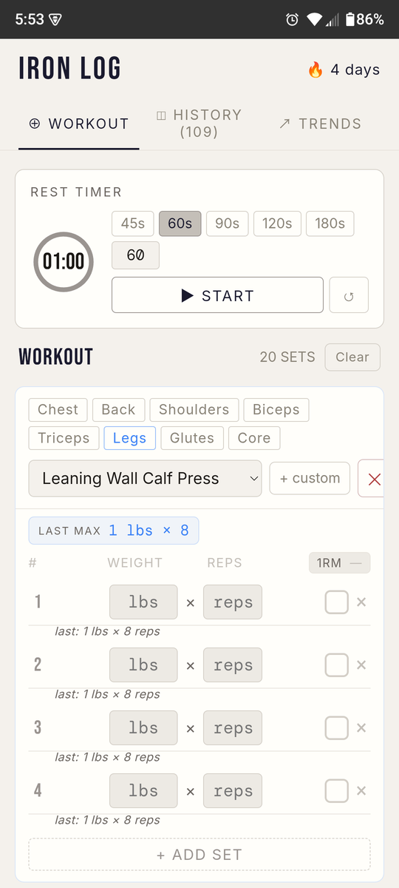
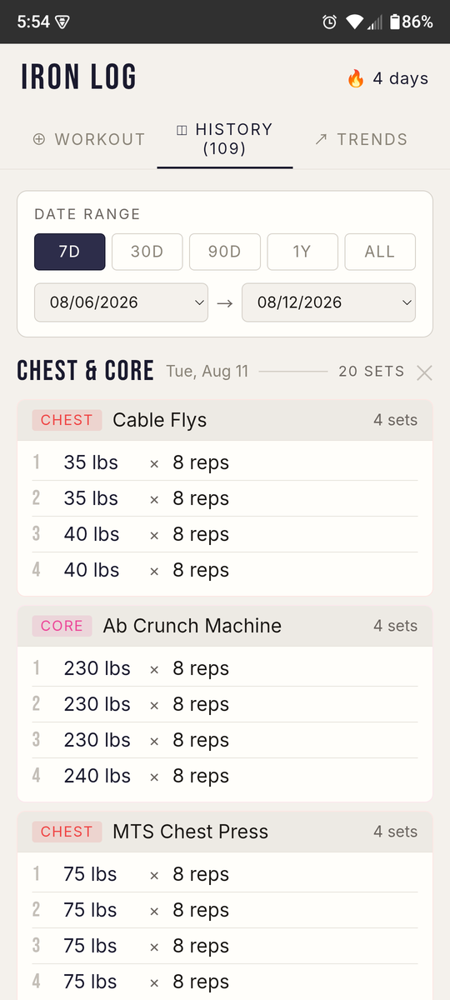
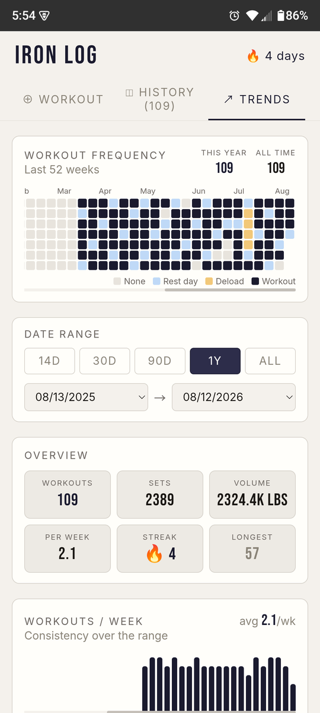
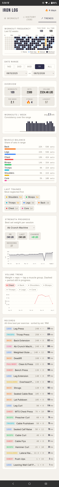
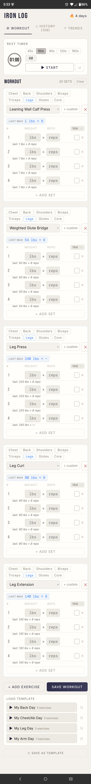
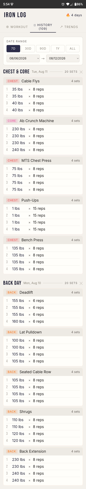

# 🏋️ IRON LOG

A fast, mobile-first weightlifting tracker. Log workouts, track progress, and
analyse trends — all from your phone, with no account and no server.

<div align="center">
  
  
  
</div>

<div align="center"><sub><b>Workout</b> · <b>History</b> · <b>Trends</b></sub></div>

---

## Features

### 📋 Workout logging

- Build a session from any number of exercises and sets
- Per-set **weight**, **reps**, a done checkbox, and an estimated **1RM**
- Every set row shows **`last: 145 lbs × 8 reps`** — what you did on that set
  last time, so progressive overload needs no mental arithmetic
- A **`LAST MAX`** pill per exercise shows the best set you have ever logged
- Sets auto-populate from your previous set for fast entry
- Workouts are **auto-named from the muscle groups trained** ("Chest & Core",
  "Back Day") — no dropdown to fiddle with
- Inline two-tap delete on sets, and a two-tap **Clear** to discard a session
- **Templates** — save a session shape and reload it next time

### ⏱️ Rest timer

- Circular countdown with presets (45s / 60s / 90s / 120s / 180s) or a custom
  duration
- **Survives Android Doze.** Uses `allowWhileIdle` alarms plus a local
  notification, so the bell still rings with the screen off and the app in the
  background — verified over a week of real workouts
- In-progress workouts persist as a draft, and an **unsaved-workout reminder**
  fires if you walk away mid-session

### 💪 Exercise library

- 8 muscle groups — Chest, Back, Shoulders, Biceps, Triceps, Legs, Glutes, Core
  (plus Full Body on records)
- Preset exercises per group, and **custom exercises** that are saved and
  reappear in future sessions

### 📅 History

- Every saved session with date, set count, and the full per-exercise breakdown
- Filter by range — 7D / 30D / 90D / 1Y / ALL, or pick explicit start and end
  dates
- Delete an individual session, or clear everything

### 📈 Trends dashboard

A full analytics page, not just a chart:

| Panel | What it tells you |
|---|---|
| **Frequency heatmap** | Every day colour-coded — None / Rest day / Deload / Workout |
| **Overview tiles** | Workouts, total sets, total volume, per-week average, current streak, longest streak |
| **Workouts / week** | Consistency across the selected range |
| **Muscle balance** | Share of sets per muscle group — what you are over- and under-training |
| **Last trained** | Days since each group, **most neglected first** |
| **Strength progress** | Per exercise: PR, last session, change, session count, and a best-set-weight chart |
| **Volume trend** | Weight × reps over time for one muscle group, with adaptive weekly/monthly binning |
| **Records** | All-time best per exercise, sorted by estimated 1RM |

Two details that took real tuning:

- **Streaks are strict.** A streak needs consecutive calendar days; a day counts
  if you trained *or* logged a rest day. No grace period — training every other
  day does not hold a streak.
- **Deload days** are marked by tapping a heatmap cell (blank → rest day →
  deload → blank). A deload holds a streak the same as a rest day, because
  programmed light work is not a skipped day. Nothing is auto-detected.
- The volume chart draws the **current, still-filling period dashed** with a
  hollow point, and skips periods where the group was not trained — otherwise
  a partial month or a week of leg days reads as a collapse in chest volume.

### 💾 Your data stays yours

- Everything lives in **localStorage** on the device. No account, no server, no
  telemetry.
- **Backup / restore** to a portable `.ilbak` file — save it or share it out
  through the Android share sheet, and restore it on another device.

---

## Install

**Android:** grab `iron-log.apk` from the
[latest release](https://github.com/curtisecombsjr/iron-log/releases) and
sideload it. It is a debug-signed build — Android will ask you to allow
installs from your browser or file manager.

**Web:** it also runs as a plain web app in any modern browser.

---

## Tech stack

- [React 18](https://react.dev/) — UI
- [Vite](https://vitejs.dev/) — build tool
- [Capacitor](https://capacitorjs.com/) — Android wrapper
  (`@capacitor/local-notifications`, `@capacitor/filesystem`, `@capacitor/share`)
- localStorage — persistence
- SVG — every chart is hand-rolled; no charting library
- Web Audio API + a bundled `bell.wav` — rest-timer alert

Single **Light** theme: Bebas Neue display, DM Mono for numerics, Inter for body
text.

---

## Run locally

```bash
git clone https://github.com/curtisecombsjr/iron-log
cd iron-log
npm install
npm run dev          # http://localhost:5173
```

Build the web bundle:

```bash
npm run build
```

Build the Android APK (needs **JDK 21** — Capacitor's plugins target 21, and the
system default is usually 17):

```bash
npm run build
npx cap sync android
cd android && JAVA_HOME=/usr/lib/jvm/zulu-21 ./gradlew assembleDebug
cp app/build/outputs/apk/debug/app-debug.apk app/build/outputs/apk/debug/iron-log.apk
```

---

## Development & releases

- **`develop`** — integration branch; day-to-day work lands here
- **`main`** — release branch; only merged into from `develop`
- **Tags** — `vX.Y.Z` on `main` marks a release

CI (`.github/workflows/build.yml`) builds the APK on pushes to `develop`/`main`
and on PRs to `develop`; on a `v*` tag it publishes a GitHub Release with
`iron-log.apk` attached.

To cut a release:

```bash
# on develop: bump package.json + android/app/build.gradle, update CHANGELOG.md
git checkout main && git merge --no-ff develop && git push origin main
git tag vX.Y.Z && git push origin vX.Y.Z
```

Full change history is in [CHANGELOG.md](CHANGELOG.md). Current version:
**v1.5.1**.

---

<details>
<summary><b>More screenshots</b> — each tab scrolled end to end (click to expand)</summary>

<br>

**Trends** — the whole dashboard: frequency heatmap (rest days and deloads
included), date range, overview tiles, consistency, muscle balance, last
trained, strength progress, volume trend, and the all-time records board.

<div align="center">
  
</div>

**Workout** — the rest timer, then one card per exercise: muscle-group chips,
exercise picker, `LAST MAX`, and per-set weight/reps with last-time hints.

<div align="center">
  
</div>

**History** — the range filter, then one block per session with every exercise
and set.

<div align="center">
  
</div>

</details>

<sub>Screenshots are captured over adb with
<a href="tools/capture-screens.py"><code>tools/capture-screens.py</code></a>,
which scrolls each tab and stitches the frames into one full-page image.</sub>
